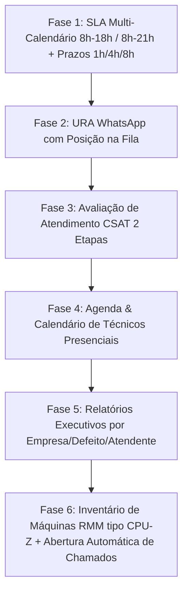

# Plano de Implementação Atualizado: Novas Funcionalidades e Melhorias no DeskFlow

Este documento apresenta o plano técnico e arquitetural revisado para as 6 melhorias do DeskFlow, incluindo a **Criação Automática Inteligente de Chamados via Alertas RMM com Anti-Spam/Deduplicação**.

> [!IMPORTANT]
> **Modo de Planejamento:** Nenhuma alteração no código-fonte será executada até a sua aprovação explícita deste plano.

---

## 1. Módulo de SLA Avançado com Múltiplos Calendários (Horas Úteis)

### Requisitos do Negócio
* **Dois Calendários de Atendimento:**
  1. **Horário Padrão:** Segunda a Sexta-feira, das 08:00 às 18:00 (pausa nos finais de semana).
  2. **Horário Estendido:** Domingo a Domingo, das 08:00 às 21:00 (todos os dias).
* **Prazos em Horas Úteis:**
  * **1h útil:** Primeiro atendimento inicial (*First Response Time*).
  * **4h úteis:** Resolução de chamados remotos (*Resolution Time*).
  * **8h úteis:** Atendimento presencial (*On-site Service Resolution*).
* **Mensagem Automática Fora do Horário:**
  * Se o cliente contatar fora do horário do seu calendário contratado, receberá aviso automático informando que o atendimento será iniciado no próximo dia útil / abertura do expediente.

### Arquitetura Técnica
* **Backend:**
  * [sla-policy.entity.ts](file:///d:/SISTEMAS/DESKFLOW/DeskFlow/backend/src/sla/entities/sla-policy.entity.ts): Campos `calendar_type` (`'standard_8_18'` | `'extended_8_21'`), `first_response_mins` (60), `resolution_mins` (240), `onsite_resolution_mins` (480).
  * [business-hours.util.ts](file:///d:/SISTEMAS/DESKFLOW/DeskFlow/backend/src/sla/business-hours.util.ts): Cálculo preciso em horas úteis para ambos os calendários e função `isWithinBusinessHours(date, calendarType)` com previsão de reabertura.
  * [organization.entity.ts](file:///d:/SISTEMAS/DESKFLOW/DeskFlow/backend/src/organizations/entities/organization.entity.ts): Vínculo da política/calendário por cliente/empresa.
* **Frontend:**
  * [SlaPoliciesView.vue](file:///d:/SISTEMAS/DESKFLOW/DeskFlow/frontend/src/views/admin/SlaPoliciesView.vue): Seletor de tipo de calendário e definição dos prazos de 1h, 4h e 8h.

---

## 2. Módulo de Relatórios & Analytics Executivos

### Requisitos do Negócio
* **Por Empresa / Organização:** Total de chamados, abertos, resolvidos, violados, TMR (Tempo Médio de Resposta) e TMT (Tempo Médio de Resolução) por cliente.
* **Por Defeito / Categoria / Motivo:** Ranking dos problemas mais comuns (Hardware, Rede, Impressora, Software, Lentidão, etc.).
* **Por Atendente / Agente:** Volume de chamados atribuídos, resolvidos, TMR, TMT e média de satisfação CSAT por técnico.
* **Filtros & Exportação:** Filtro por período (Hoje, 7d, 30d, Mês, Customizado), Empresa e Atendente, com exportação CSV/Excel.

### Arquitetura Técnica
* **Backend:**
  * [reports.service.ts](file:///d:/SISTEMAS/DESKFLOW/DeskFlow/backend/src/reports/reports.service.ts): Métodos de agregação por empresa, categoria/defeito e atendente.
  * [reports.controller.ts](file:///d:/SISTEMAS/DESKFLOW/DeskFlow/backend/src/reports/reports.controller.ts): Endpoints `GET /reports/executive` e `GET /reports/export`.
* **Frontend:**
  * [AnalyticsView.vue](file:///d:/SISTEMAS/DESKFLOW/DeskFlow/frontend/src/views/admin/AnalyticsView.vue): Abas *Visão Geral*, *Por Empresa*, *Por Defeito* e *Por Atendente*, com gráficos e exportação.

---

## 3. Inventário de Máquinas & RMM com Abertura Automática Inteligente de Chamados

### Requisitos do Negócio
* **Telemetria de Hardware & Software (Estilo CPU-Z / Speccy / Milvus):**
  * **Processador:** Modelo, núcleos físicos/lógicos, frequência, temperatura e % de uso.
  * **Memória RAM:** Total, em uso, % de consumo e slots instalados.
  * **Discos / Armazenamento:** Lista de unidades (C:, D:), tipo (SSD/HDD), espaço livre/total e saúde SMART.
  * **Placa-Mãe, GPU, SO, IP/MAC, Uptime e Softwares Instalados.**
* **Agente Coletor do Cliente:**
  * Script/executável leve para Windows que roda em segundo plano e envia a telemetria via API HTTPS a cada 5–15 minutos.
* **Abertura Automática Inteligente de Chamados:**
  * **Gatilhos Críticos:** Disco com mais de 90% de uso, RAM acima de 95% ou falha SMART detectada no SSD/HD.
  * **Criação Automática:** O DeskFlow abre o chamado no momento do alerta:
    * *Título:* `[ALERTA RMM] Disco C: Crítico (94%) - Maq: DESKTOP-FINANCEIRO (Empresa ABC)`
    * *Prioridade:* Alta / Urgente
    * *Vínculo:* Vinculado à máquina e à empresa/cliente correspondente.
  * **Anti-Deduplicação (Anti-Spam):** Se já houver um chamado aberto para aquele mesmo defeito daquela máquina, o sistema **não cria chamados repetidos**, apenas atualiza os logs.
  * **Configuração no Painel:** O Administrador pode ativar/desativar a abertura automática e calibrar os limites percentuais.
  * **Botão Manual de Abertura:** Presente na gaveta da máquina para manutenções preventivas avulsas.

### Arquitetura Técnica
* **Backend (`backend/src/assets/` - [NOVO MÓDULO]):**
  * `asset.entity.ts`: Tabela de máquinas e dados de telemetria.
  * `asset-alert.entity.ts`: Tabela de alertas de hardware e consumo.
  * `assets.service.ts`:
    * Recepção de telemetria e análise de regras (Disco > 90%, RAM > 95%, SMART).
    * `createTicketFromAlert`: Criação automática inteligente com verificação de chamados abertos existentes para a mesma máquina/alerta.
    * Geração do instalador do agente (`deskflow-agent.ps1` / `.exe`).
* **Frontend:**
  * `AssetsView.vue`: Painel de inventário com cartões de status (Total, Online, Offline, Alertas), tabela com barras visuais de consumo e modal estilo **CPU-Z** com abas detalhadas.
  * Botão de 1 clique para baixar/copiar o comando de instalação do agente com o token da empresa.
  * [TicketDetailView.vue](file:///d:/SISTEMAS/DESKFLOW/DeskFlow/frontend/src/views/TicketDetailView.vue): Exibição dos computadores do cliente na barra lateral do chamado.

---

## 4. URA Interativa WhatsApp com Posição na Fila em Tempo Real

### Requisitos do Negócio
* **Boas-Vindas e Menus de Filas:**
  ```text
  Olá, seja bem vindo!
  Nosso horário de atendimento é de segunda à sexta das 8 às 18h.
  (Para clientes com horário estendido, atendemos das 08h às 21h.)

  Escolha uma fila de atendimento para ser atendido: 
  1 - Suporte
  2 - Comercial
  3 - Financeiro
  # - Finalizar o chat.
  ```
* **Seleção da Fila e Cálculo de Posição:**
  * Ao escolher a opção (ex: `1`):
    ```text
    Opção selecionada: Suporte
    Enquanto você aguarda pelo atendimento, explique com o máximo de detalhes, isso irá agilizar...

    Você é o 2° na fila
    ```
* **Cálculo da Posição:** Contagem dinâmica em tempo real de chamados na mesma fila/grupo criados antes do chamado atual e ainda não assumidos por um agente.

### Arquitetura Técnica
* **Backend:**
  * [whatsapp.service.ts](file:///d:/SISTEMAS/DESKFLOW/DeskFlow/backend/src/whatsapp/whatsapp.service.ts): Máquina de estados de conversação (`AWAITING_MENU`, `IN_QUEUE`, `IN_SERVICE`, `CSAT`).
  * Método `getQueuePosition(ticketId, groupId)` com contagem de tickets na frente na fila.

---

## 5. Avaliação de Atendimento WhatsApp (CSAT em 2 Etapas)

### Requisitos do Negócio
* **Etapa 1 — Disparo Automático na Resolução do Chamado (`state_id = 5`):**
  ```text
  Por favor, nos conte como foi o seu atendimento.
  1. 😔 Péssimo
  2. 🙁 Ruim
  3. 😐 Regular
  4. 😀 Bom
  5. 🤩 Excelente
  9. ❌ Não avaliar
  ```
* **Etapa 2 — Coleta de Motivo / Feedback:**
  * Ao responder `1` a `5`:
    ```text
    Agradecemos a sua avaliação, por favor descreva o motivo que levou você a classificar esse atendimento ou digite 9 para encerrar sem um motivo.
    ```
  * Ao receber o texto ou `9`: Salva a nota e o comentário no ticket e agradece o cliente.

### Arquitetura Técnica
* **Backend:**
  * [whatsapp.service.ts](file:///d:/SISTEMAS/DESKFLOW/DeskFlow/backend/src/whatsapp/whatsapp.service.ts): Transição para estado de pesquisa CSAT ao encerrar chamado e captura de nota e comentário em duas mensagens subsequentes.
  * [ticket.service.ts](file:///d:/SISTEMAS/DESKFLOW/DeskFlow/backend/src/tickets/services/ticket.service.ts): Persistência de `satisfaction_score` e `satisfaction_comment`.

---

## 6. Agenda de Atividades do Técnico Externo (Field Service)

### Requisitos do Negócio
* **Automação Presencial:**
  * Ao transferir ou alterar o chamado para "Atendimento Presencial", o sistema automaticamente:
    1. Cria uma atividade na **Agenda / Calendário**.
    2. Aplica o SLA presencial de **8 horas úteis**.
    3. Vincula o chamado, técnico responsável, data/hora e o endereço da empresa/cliente.
* **Visão de Calendário:**
  * Tela interativa (Mês, Semana, Dia, Lista) para técnicos e gestores gerenciarem os atendimentos presenciais.
  * Status da visita (*Agendado*, *Em Deslocamento*, *Em Atendimento*, *Concluído*).

### Arquitetura Técnica
* **Backend (`backend/src/field-service/` - [NOVO MÓDULO]):**
  * `field-activity.entity.ts`: Entidade de atividades/visitas externas.
  * `field-service.service.ts` & `field-service.controller.ts`: CRUD de atividades e integração automática via hook do `TicketService`.
* **Frontend:**
  * `CalendarView.vue`: Calendário interativo de atividades com modal de detalhes, rota no mapa e atualização de status de atendimento em campo.

---

## 🚀 Ordem de Execução Proposta



---

## 🧪 Plano de Verificação e Testes

* **SLA:** Testes unitários do cálculo de horas úteis nos dois calendários e verificação da mensagem fora do expediente.
* **URA WhatsApp:** Simulação de seleção de fila, retorno da posição na fila e encerramento com `#`.
* **CSAT WhatsApp:** Teste de resolução de ticket, captura da nota (1 a 5) e do motivo.
* **Agenda Presencial:** Teste de transferência de ticket gerando evento na agenda com SLA de 8h úteis.
* **Relatórios:** Teste de agrupamento por empresa, defeito e atendente com exportação CSV.
* **Inventário RMM:** Envio de telemetria simulada da máquina e verificação da abertura automática do chamado com bloqueio de duplicação.
